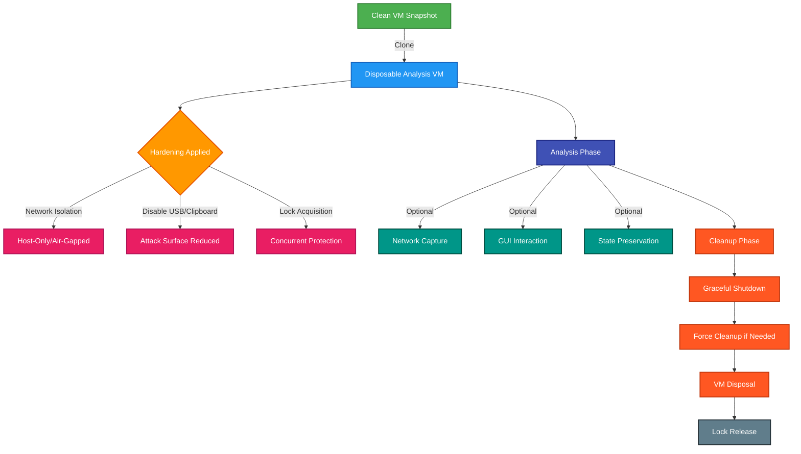

<div align="center">

# 🔒 Isol8
### *Disposable VM Analysis Made Simple*

[](https://virtualbox.org)
[](#security-features)

*A lightweight Python tool for secure malware analysis using disposable VirtualBox environments*

[What is Isol8?](#-what-is-isol8) •
[Architecture Overview](#️-architecture-overview) •
[Quick Start](#-quick-start) •
[Usage Examples](#-usage-examples) •
[Configuration Options](#️-configuration-options) •
[Security Features](#️-security-features) •
[Interesting Comparison](#-interesting-comparison) •
[Installation](#-installation) •
[Troubleshooting](#-troubleshooting) •

---

</div>

## ➀ [What is Isol8?](#-what-is-isol8)

Isol8 transforms VirtualBox into a secure malware analysis platform through intelligent VM lifecycle management. Unlike complex sandbox frameworks requiring dedicated infrastructure, Isol8 delivers enterprise-grade isolation in a single Python script.

```bash
# One command to secure, isolated analysis
python isol8.py --vm MalwareBase --snapshot clean --tcpdump --auto-shutdown 300
```

### **The Problem**
- **Traditional Sandboxes** require complex server infrastructure, databases, and maintenance overhead
- **Manual VM Management** lacks proper hardening, cleanup, and monitoring integration
- **Enterprise Solutions** are overkill for research, learning, or ad-hoc analysis

### **The Solution**
Isol8 bridges this gap with:
- ⚡ **Instant Deployment** - No infrastructure setup required
- 💾 **Storage Efficient** - Linked clones use 90% less disk space
- 🔐 **Security Hardened** - Automatic isolation and attack surface reduction
- 🎛️ **Interactive Analysis** - Direct GUI access when needed
- 🧹 **Zero Residue** - Guaranteed cleanup with emergency fallbacks

---

## ➁ [Architecture Overview](#️-architecture-overview)

<div align="center">



</div>

---

## ➂ [Quick Start](#-quick-start)

### Prerequisites
- Python 3.7+
- VirtualBox installed and in PATH
- A VM with clean snapshots ready

### One-Line Setup
```bash
# Clone and run
git clone https://github.com/yourusername/isol8.git && cd isol8
python isol8.py
```

### Interactive Mode
```bash
# Select VM and snapshot interactively
python isol8.py

Available Virtual Machines:
[1] Windows10-Analysis
[2] Ubuntu-Sandbox
[3] MalwareBase
Select VM number: 1

Available Snapshots:
[1] CleanBase
[2] clean-base  
[3] PreInfection
Select snapshot: 1
```

---

## ➃ [Usage Examples](#-usage-examples)

<details>
<summary><b>🔍 Quick Analysis Session</b></summary>

```bash
# Start interactive analysis with network monitoring
python isol8.py --vm MalwareBase --snapshot CleanBase --gui --tcpdump

# Output:
# [2024-01-15 14:30:25] INFO: Acquired lock on VM: MalwareBase
# [2024-01-15 14:30:26] INFO: Linked duplicate cloned: MalwareBase_ANALYSIS_12345
# [2024-01-15 14:30:27] INFO: VM hardening complete. Isolated on vboxnet0.
# [2024-01-15 14:30:28] INFO: tcpdump process commenced (PID: 54321)
# [2024-01-15 14:30:30] INFO: Commencing VM: MalwareBase_ANALYSIS_12345 in gui mode
# [2024-01-15 14:30:35] INFO: VM running. Waiting for manual shutdown...
```
</details>

<details>
<summary><b>🕐 Timed Analysis with State Preservation</b></summary>

```bash
# 5-minute automated analysis with dirty state preservation
python isol8.py --vm WindowsVM --auto-shutdown 300 --keep-current --air-gapped

# Automatically shuts down after 5 minutes and saves infected state
```
</details>

<details>
<summary><b>🌐 Network Traffic Analysis</b></summary>

```bash
# Windows guest with tshark capture on custom interface
python isol8.py --vm Win10 --os windows --interface eth0 --tcpdump

# Network capture saved at: /tmp/network_capture_12345.pcap
```
</details>

<details>
<summary><b>🧪 Dry Run Testing</b></summary>

```bash
# Test configuration without actual VM operations
python isol8.py --vm TestVM --snapshot clean --dry-run

# [dry-run] would clone linked duplicate: TestVM_ANALYSIS_12345 from TestVM @ clean
# [dry-run] would apply hardening settings
# [dry-run] would commence VM in headless mode
```
</details>

---

## ➄ [Configuration Options](#️-configuration-options)
<div align="center">

| Parameter | Description | Default | Example |
|-----------|-------------|---------|---------|
| `--vm` | Base VM name | *Interactive* | `--vm MalwareBase` |
| `--snapshot` | Clean snapshot name | `CleanBase` | `--snapshot clean-state` |
| `--os` | Guest OS type | `linux` | `--os windows` |
| `--gui` | Enable GUI mode | `false` | `--gui` |
| `--auto-shutdown` | Auto shutdown (seconds) | Manual | `--auto-shutdown 300` |
| `--keep-current` | Preserve infected state | `false` | `--keep-current` |
| `--tcpdump` | Network capture | `false` | `--tcpdump` |
| `--air-gapped` | Complete isolation | `false` | `--air-gapped` |
| `--interface` | Network interface | `vboxnet0` | `--interface eth0` |
| `--dry-run` | Test mode | `false` | `--dry-run` |

</div>

---

## ➅ [Security Features](#️-security-features)

### **VM Hardening Applied**
```python
# Automatic security configurations
settings = {
    "clipboard": "disabled",      # Prevent data exfiltration
    "draganddrop": "disabled",    # Block file transfer
    "usb": "off",                # Disable USB devices
    "audio": "null",             # Mute audio channels
}
```

### **Network Isolation Options**
- **Host-Only Mode**: VM can only communicate with host via `vboxnet0`
- **Air-Gapped Mode**: Complete network isolation (no adapter)
- **Traffic Monitoring**: Built-in tcpdump/tshark integration

### **Resource Protection**
- **File Locking**: Prevents concurrent analysis on same base VM
- **Emergency Cleanup**: Multiple fallback mechanisms ensure no VM residue
- **Atomic Operations**: Snapshot operations are transaction-safe

### **Attack Surface Reduction**
- Minimal attack vectors through disabled services
- No persistent changes to base VM
- Isolated network segments prevent lateral movement

---

## ➆ [Interesting Comparison](#-interesting-comparison)

<div align="center">

| Feature | Isol8 | Cuckoo | CAPE | Manual VMs |
|---------|-------|--------|------|------------|
| **Setup Time** | < 1 min | Hours/Days | Hours/Days | Minutes |
| **Infrastructure** | None | Server + DB | Server + DB | None |
| **Storage Overhead** | 10-50%* | 100% | 100% | 100% |
| **Interactive Access** | ✅ | ❌ | ❌ | ✅ |
| **Automated Reports** | ❌ | ✅ | ✅ | ❌ |
| **Security Hardening** | ✅ | ✅ | ✅ | ❌ |
| **Network Monitoring** | Basic | Advanced | Advanced | Manual |
| **Scalability** | Single | High | High | Manual |
| **Learning Curve** | Low | High | High | Low |
| **Analysis Depth** | Manual only | Comprehensive | Comprehensive | Manual only |
| **Team Collaboration** | ❌ | ✅ | ✅ | ❌ |
| **API Integration** | ❌ | ✅ | ✅ | ❌ |

*Storage savings vary significantly based on analysis duration and VM activity

</div>

**What Isol8 is actually good for:**
- Quick manual investigation of single samples
- Learning malware analysis techniques
- Environments with no server infrastructure
- When you need GUI access to interact with malware
- Ad-hoc analysis that doesn't require comprehensive reporting

**What traditional sandboxes are better for:**
- Automated behavioral analysis and IOC extraction
- Processing multiple samples efficiently
- Team environments requiring shared results
- Enterprise integration and API access
- Comprehensive threat intelligence generation
- Production security operations
_letmeknowyouropinion_

---

## ℘ [Installation](#-installation)

### **System Requirements**
- **OS**: Linux, macOS, Windows
- **Python**: 3.7 or higher
- **VirtualBox**: 6.0+ with VBoxManage in PATH
- **Privileges**: sudo access for network capture (optional)

### **Dependency Installation**
```bash
# Verify VirtualBox
VBoxManage --version

# For network capture (optional)
# Linux/macOS:
sudo apt install tcpdump  # or: brew install tcpdump

# Windows:
# Install Wireshark (includes tshark)
```

### **Network Setup (Optional)**
```bash
# Set up host-only network for traffic monitoring
VBoxManage hostonlyif create
VBoxManage hostonlyif ipconfig vboxnet0 --ip 192.168.56.1 --netmask 255.255.255.0
```

---

## ➈ [Troubleshooting](#-troubleshooting)
<details>
<summary><b>Common Issues & Solutions</b></summary>

### **VBoxManage not found**
```bash
# Add VirtualBox to PATH
export PATH="$PATH:/usr/local/bin"
# Or install VirtualBox properly
```

### **Permission denied for network capture**
```bash
# Grant tcpdump capabilities
sudo setcap cap_net_raw,cap_net_admin=eip /usr/bin/tcpdump
```

### **VM won't start**
```bash
# Check VirtualBox host-only network exists
VBoxManage list hostonlyifs
```

### **Lock file exists**
```bash
# Manual cleanup if interrupted
rm /tmp/isol8_vm_*.lock
```

</details>

---

## ✎ᝰ.[Contributing](#-contributing)

Here's how to get started:

1. **Fork** the repository
2. **Make** a feature branch (`git checkout -b feature/amazing-feature`)
3. **Test** your changes with `--dry-run`
4. **Commit** your changes (`git commit -m 'Add amazing feature'`)
5. **Push** to branch (`git push origin feature/amazing-feature`)
6. **Open** a Pull Request

### **Development Setup**
```bash
git clone https://github.com/yourusername/isol8.git
cd isol8

# Test with dry run
python isol8.py --dry-run --vm TestVM
```

---

<div align="center">

**[⬆ Back to Top](#-isol8)**

</div>
